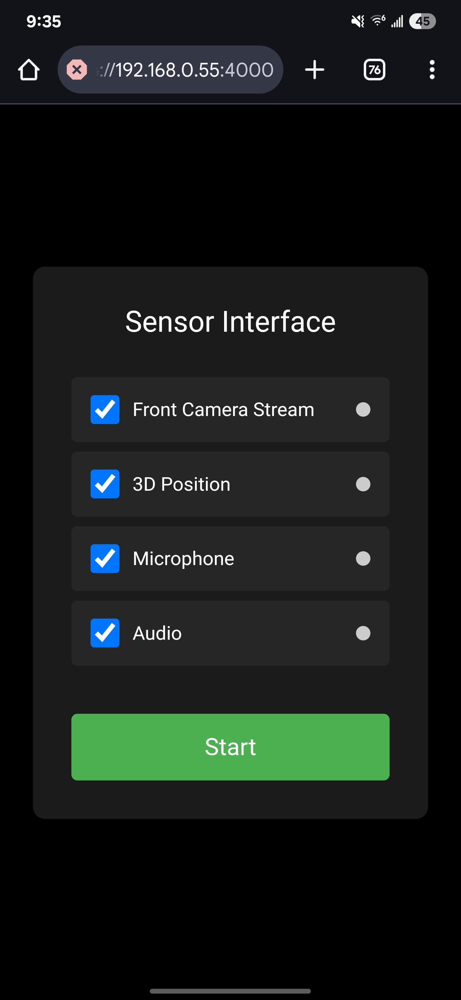

# Mobile Sensor Bridge for ROS2
This package provides a ROS2 node that streams sensor data directly from an Android smartphone including jpeg camera stream, position tracking, and bidirectional audio communication capabilities.

## Overview
Traditionally, robotics prototypes rely on separate sensors that require calibration and integration. This package transforms an Android phone into a comprehensive sensor suite by directly publishing sensor data as ROS2 topics. The node is implemented using rclnodejs, enabling native ROS2 integration within a JavaScript environment.



## Features

- **Camera Stream**: Publish mobile camera frames as ROS2 sensor_msgs/CompressedImage
- **Native ROS2 Interface**: Native ROS2 Integration
- **Position Tracking**: Stream WebXR spatial position data as geometry_msgs/Pose
- **Speech Interface**: Bidirectional audio communication with speech-to-text and text-to-speech capabilities 
- **Selectable Sensors**: Enable/disable individual sensors as needed

## Prerequisites
- ROS2 (tested with Humble)
- Node.js (v20 or newer recommended, tested with v22.14.0)
- npm (v8 or newer, tested with v10.9.2)
- Modern mobile phone if position tracking is needed WebXR support (for AR features)
- OpenSSL (for certificate generation)

## Installation

1. Clone the repository to your ROS2 workspace src directory:
   ```bash
   cd <ros2_workspace>/src/
   git clone https://github.com/VedantC2307/ros2-android-sensor-bridge.git mobile_sensor
   ```

2. Install Node.js dependencies:
   ```bash
   cd mobile_sensor
   npm install
   ```

> [!NOTE]
> The `npm install` step is critical and must be performed before building the package with colcon.

3. Generate SSL certificates (needed for secure access):
   ```bash
   cd <ros2_workspace>/src/mobile_sensor/src
   chmod +x generate_ssl_cert.sh
   ./generate_ssl_cert.sh
   ```

4. Build the ROS2 package:
   ```bash
   cd <ros2_workspace>
   colcon build --packages-select mobile_sensor
   ```

5. Source the workspace:
   ```bash
   source install/setup.bash
   ```

## Usage

1. Launch the mobile sensor node:
   ```bash
   ros2 launch mobile_sensor mobile_sensors.launch.py
   ```

2. Access the web interface on your mobile device:
   - Open a browser on your mobile device and navigate to `https://<your_computer_ip>:4000`
   - Accept the security warnings about the self-signed certificate
   - Grant permissions for camera, microphone, and AR features when prompted
   - Select the sensors you want to use and click "Start"

## ROS2 Topics

The package publishes to the following ROS2 topics:

- `/camera/image_raw/compressed`: Camera images (sensor_msgs/CompressedImage)
- `/camera/camera_info`: Camera calibration data (sensor_msgs/CameraInfo)
- `/mobile_sensor/pose`: AR position data (geometry_msgs/Pose)
- `/mobile_sensor/speech`: Transcribed speech (std_msgs/String)

To send text-to-speech messages to the device, publish to:

- `/mobile_sensor/tts`: Text to be spoken (std_msgs/String)


## Contributing
Contributions are welcome! Please feel free to submit a Pull Request.
